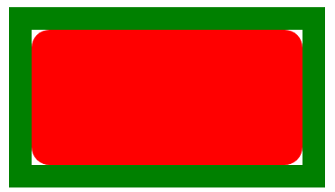
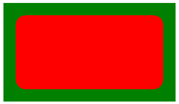

## 双飞翼布局
```
  <div id="box">
    为了先渲染 center  所以把center放上面
    <div class="center">
      <div class="inner">c</div>
    </div>
    <div class="left">A</div>
    <div class="right">B</div>
  </div>

布局
    .left {
      width: 200px;
      float: left;
      margin-left: -100%;
    }
    .right {
      width: 300px;
      float: left;
      margin-left: -300px
    }
    .center {
      width: 100%;
      float: left;
    }
    .center .inner {
      margin-left: 200px;
    }

让 left right center 等高方法
.box {
  overflow: hidden
}
.left, .center, .right{
  padding-bottom: 9999px;
  margin-bottom: 9999px;
}

```

## h5布局
```
html {box-sizing:border-box}
*,*:before, *:after{box-sizing: inherit}
```

```
img { clip-path:polygon(50% 0,100% 50%,50% 100%,0 50%)}
img:hover {clip-path:polygon(0 0,100% 0,100% 100%,0 100%)}
```



```
.test {
  margin: 100px;
  width: 300px;
  height:150px;
  border-radius: 20px;
  background: red;
  outline: 25px solid green;
  <!-- 添加 box-shadow 属性 根2 - 1 -->
  box-shadow: 0 0 0 8px green;
}
```
```
transform 从右往左读
缩放X 旋转X 旋转Y 缩放Y 位移X 位移Y
transform: matrix(scaleX,rotateX,rotateY,scaleY,translateX,translateY)
```
