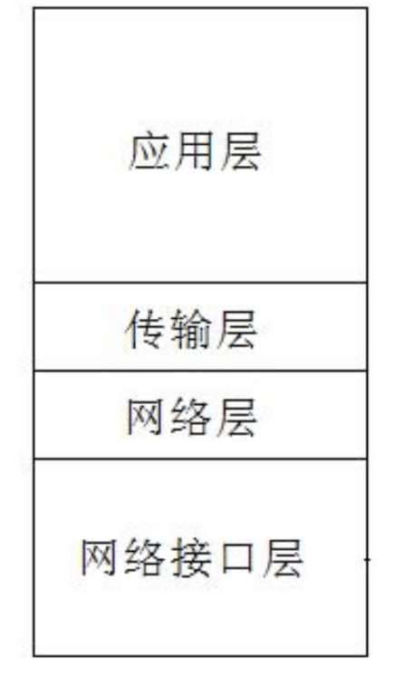
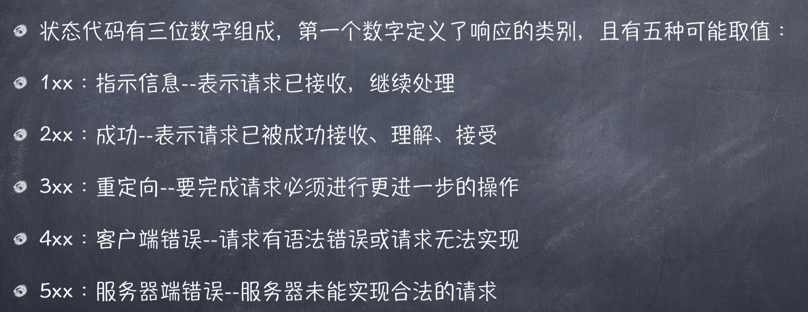
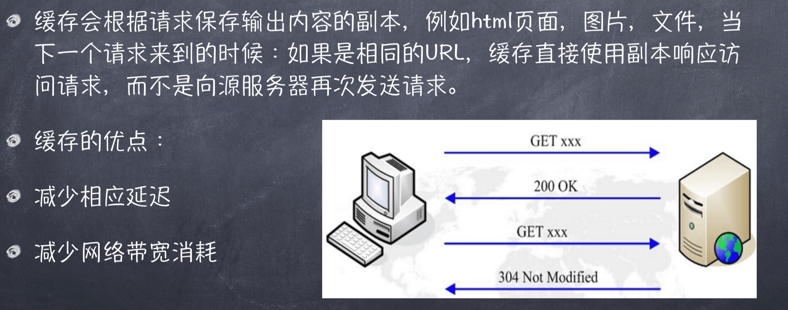
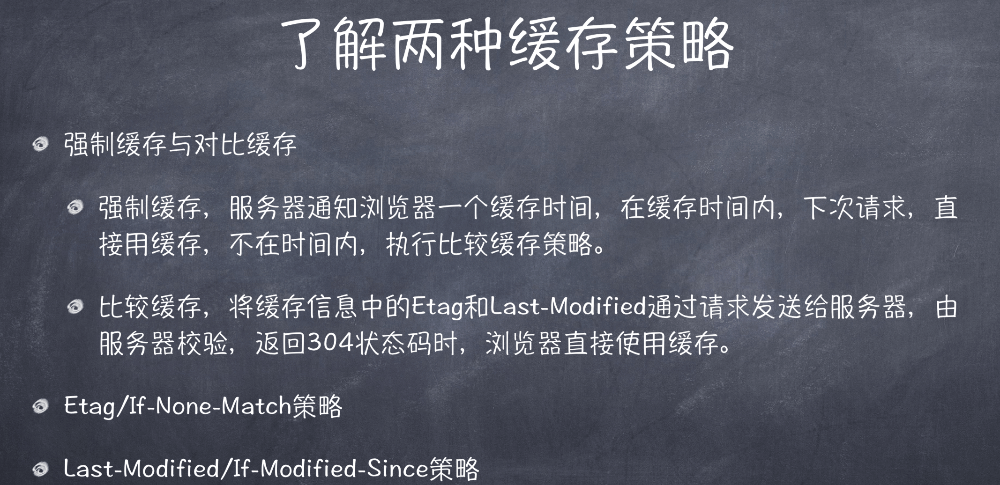

#  什么是HTTP协议
>+ HTTP是超文本传输协议，从www浏览器传输到本地浏览器的一种传输协 议，网站是基于HTTP协议的，例如网站的图片、CSS、JS等都是基于 HTTP协议进行传输的。
>+ HTTP协议是由从客户机到服务器的请求(Request)和从服务器到客户机 的响应(response)进行约束和规范。

## 了解TCP/IP协议栈

1. 应用层 
>+ 为用户提供所需要的各种服务，例如:HTTP、FTP、DNS、SMTP等.
2. 传输层
>+ 为应用层实体提供端到端的通信功能，保证数据包的顺序传送及数据的完整性。
>+ 该层定义了两个主要的协议:传输控制协议(TCP)和用户数据报协 议(UDP).
3. 网络层
>+ 主要解决主机到主机的通信问题。IP协议是网际互联层最重要的协 议。
4. 网络接口层 
>+ 负责监视数据在主机和网络之间的交换。

<!-- |应用层|
|:--|
|传输层|
|网络层|
|网络接口层| -->

##  在TCP/IP协议栈中的位置

##  HTTP的工作过程

##  HTTP状态码

##  常用的请求报头

##  HTTP缓存机制

## HTTPS协议分析

