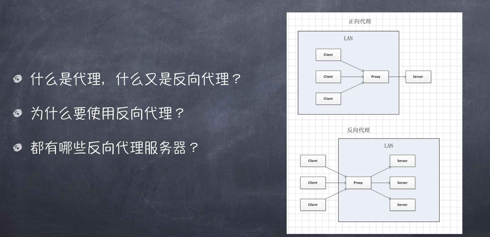
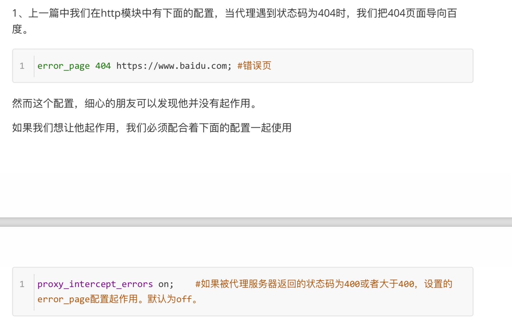
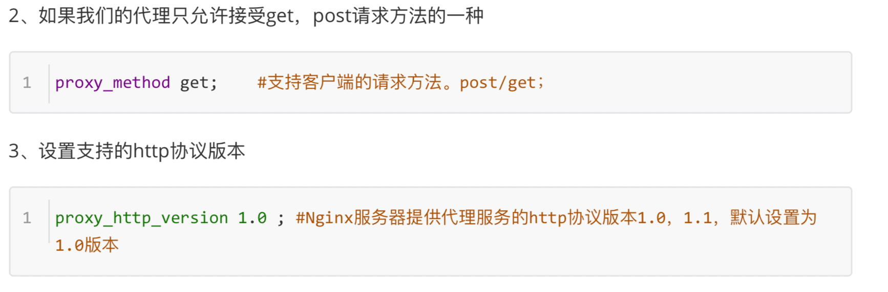
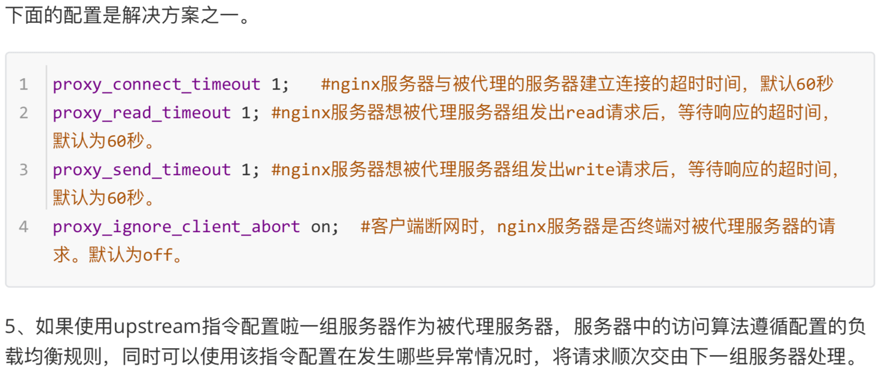
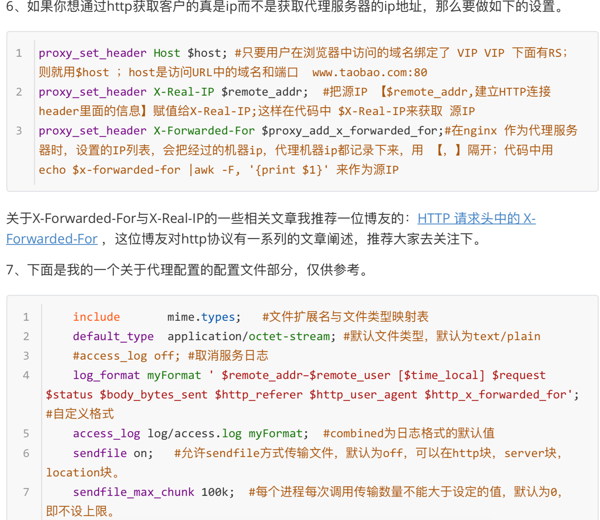
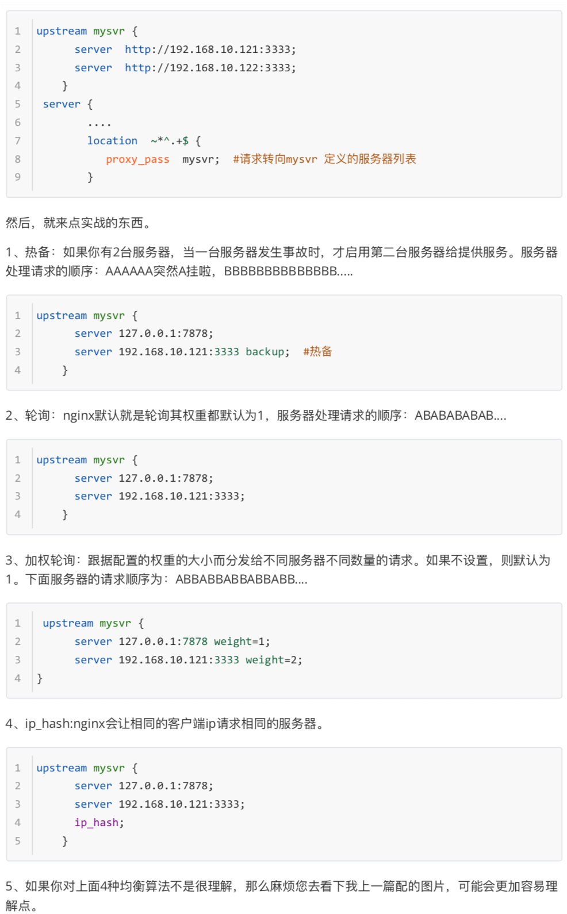

##  HTTP与反向代理


## 反向代理的用途


## Nginx配置文件结构
```
#user  nobody;
worker_processes  1;
#error_log  logs/error.log;
#error_log  logs/error.log  notice;
#error_log  logs/error.log  info;
#pid        logs/nginx.pid;
events {
    worker_connections  1024;
}
http {
    include       mime.types;
    default_type  application/octet-stream;
    #log_format  main  '$remote_addr - $remote_user [$time_local] "$request" '
    #                  '$status $body_bytes_sent "$http_referer" '
    #                  '"$http_user_agent" "$http_x_forwarded_for"';
    #access_log  logs/access.log  main;
    sendfile        on;
    #tcp_nopush     on;
    #keepalive_timeout  0;
    keepalive_timeout  65;
#gzip on;
server {
    listen       80;
    server_name  localhost;
    #charset koi8-r;
    #access_log  logs/host.access.log  main;
    location / {
        root   html;
        index  index.html index.htm;
    }
    #error_page  404              /404.html;
    # redirect server error pages to the static page /50x.html
    #
    error_page   500 502 503 504  /50x.html;
    location = /50x.html {
        root   html;
    }
    # proxy the PHP scripts to Apache listening on 127.0.0.1:80
    #
    #location ~ \.php$ {
    #    proxy_pass   http://127.0.0.1;
#}
    # pass the PHP scripts to FastCGI server listening on 127.0.0.1:9000
    #
    #location ~ \.php$ {
    #    root           html;
    #    fastcgi_pass   127.0.0.1:9000;
    #    fastcgi_index  index.php;
    #    fastcgi_param  SCRIPT_FILENAME  /scripts$fastcgi_script_name;
    #    include        fastcgi_params;
    #}
    # deny access to .htaccess files, if Apache's document root
    # concurs with nginx's one
    #
    #location ~ /\.ht {
# deny all;
#}
}
    # another virtual host using mix of IP-, name-, and port-based
configuration
# #server {
    #    listen       8000;
    #    listen       somename:8080;
    #    server_name  somename  alias  another.alias;
#
#
# #} #}
location / {
    root   html;
# HTTPS server
#
#server {
#    listen
index  index.html index.htm;
                  443 ssl;
#    server_name  localhost;
#    ssl_certificate      cert.pem;
#    ssl_certificate_key  cert.key;
#    ssl_session_cache    shared:SSL:1m;
#    ssl_session_timeout  5m;
#    ssl_ciphers  HIGH:!aNULL:!MD5;
#    ssl_prefer_server_ciphers  on;
#
#
# #} #}
}
```
### nginx文件结构
```
... #全局块
events { ... #events块
}
http #http块
{
... #http全局块
  server #server块
  {
  ... #server全局块
          location [PATTERN] #location块
          {
  ... }
          location [PATTERN]
          {
  ... }
  }
  server
  { ...
  }
... #http全局块
}
```


## 配置注意


## 配置说明








## 负载均衡




## 常用笔记
1. nginx常用命令
>+ nginx -s stop 强制关闭 
>+ nginx -s quit 安全关闭 
>+ nginx -s reload 改变配置文件的时候，重启nginx工作进程，来时配置文件生效 
>+ nginx -s reopen 打开日志文件
>+ cd /usr/local/etc/  mac 进入配置文件 
>+ cp nginx.config nginx.config.back  复制配置文件

2. 反向代理 负载均衡
```
http {
    upstream myser {
        ip_hash;
        server http://www.hellojs.xyz;
        server http://47.104.160.13:3000/;
    }
    server {
        listen 8080;
        location / {
            proxy_pass http://114.116.243.163
        }
    }
}
<!-- ip_hash 相同用户访问相同服务器 -->
<!-- weight 权重 -->
<!-- 配置文件命名问 nginx.conf  便于运维去扒 -->
```
